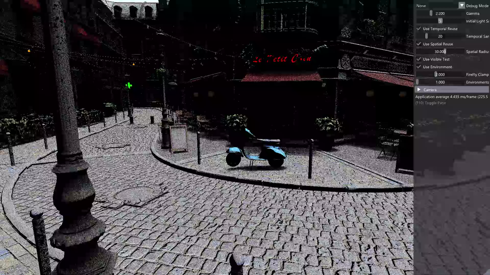
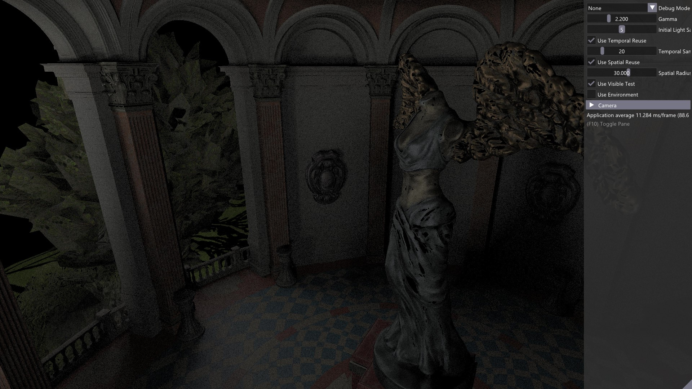

Vulkan-ReSTIR friendly to NVIDIA Vulkan Wrapper
================


## 1. Explanation
This project is the implementation of [Spatiotemporal reservoir resampling for real-time ray tracing with dynamic direct lighting](https://research.nvidia.com/sites/default/files/pubs/2020-07_Spatiotemporal-reservoir-resampling/ReSTIR.pdf) on Vulkan API with [NVIDIA Wrapper](https://github.com/nvpro-samples)

## 2. Requirements on Windows:
- Visual Studio 2019
- Vulkan SDK above version 1.2.162.0.
- NVIDIA graphics board that supports `VK_KHR_ray_tracing_pipeline` extension and corresponding drivers (latest recommended)
- CMake above version 3.9.6.

The code has not been tested on other platforms.

## 3. Setup
 1. Clone this repository as follows,
   ```
   https://github.com/dipmizu914/ReSTIR_on_Vulkan.git --recurse-submodules
   ```
 2. Build by using CMake.

## 3. Other Demos
### Sponza

### Cornell Box

### Bistro (with Triangle Lights)

### Bistro (with IBL)

### Sun Tample (with Triangle Lights)

### Sun Tample  (with IBL)


## 4. Implementation
- [x] Triangle Light
- [ ] (Beta) IBL 

# License
The source code is licensed MIT. The website content is licensed CC BY 4.0, see LICENSE.